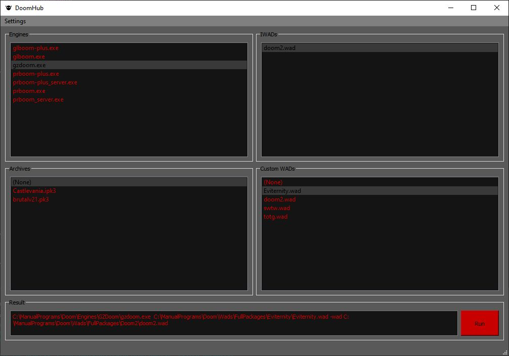

# WinDoomHub

A program to help you run different configurations of Doom.  For Windows only.

### Usage

Set the paths in Settings > Paths to point to folders containing doom engines, doom IWADs, doom archives and doom custom wads.  The list views on the main screen will populate with the relevant files.  Select the combination you want to run (one selection per list view).  At the bottom in the result window the command to run this combination will be built.  You can edit this to add other custom settings.  Click the Run button and whatever is in this text box will be executed as if it were on the command line.  
